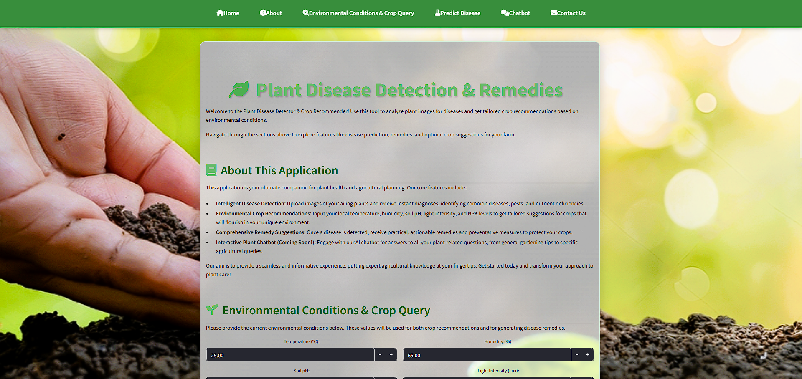

# Crop-disease-detection-model-using-AI

🌿 Plant Disease Detector & Crop Recommender
This Streamlit application serves as a comprehensive tool for agricultural assistance, offering plant disease detection, tailored crop recommendations based on environmental conditions, and AI-driven remedies. It leverages a custom U-Net model for precise leaf segmentation and Google's Gemini API for advanced AI capabilities.

✨ Features
Intelligent Disease Detection: Upload images of your plant leaves to instantly detect various diseases, pests, and nutrient deficiencies using an integrated deep learning model.

Environmental Crop Recommendations: Input specific environmental parameters (temperature, humidity, soil pH, light intensity, NPK levels, rain status) to receive data-driven crop suggestions that are most suitable for your conditions.

Comprehensive Remedy Suggestions: For detected diseases, the application provides practical and actionable remedies, medicines, and preventative measures to help you protect and nurture your crops.

Visual Disease Segmentation: See a visual representation of the detected disease regions on your uploaded plant image, pinpointing affected areas.

User-Friendly Interface: Built with Streamlit, providing an intuitive and responsive web interface for seamless interaction.

🚀 Setup and Installation
Follow these steps to set up and run the application locally:

Prerequisites
Python 3.8+

pip (Python package installer)

1. Clone the Repository
First, clone this GitHub repository to your local machine:

git clone https://github.com/YourGitHubUsername/your-repo-name.git
cd your-repo-name

2. Install Dependencies
Install the required Python packages using pip:

pip install -r requirements.txt

(Note: You'll need to create a requirements.txt file in your repository with the following content:)

streamlit
torch
torchvision
Pillow
numpy
opencv-python
requests

3. Obtain API Key
This application uses the Google Gemini API for its intelligent features. You need to obtain an API key:

Go to the Google AI Studio and create a new API key.

Save this API key in a file named .streamlit/secrets.toml in the root directory of your project (create the .streamlit folder if it doesn't exist).

# .streamlit/secrets.toml
GENERATIVE_LANGUAGE_API_KEY = "YOUR_API_KEY_HERE"

Replace YOUR_API_KEY_HERE with your actual Gemini API key.

Alternatively, you can set GENERATIVE_LANGUAGE_API_KEY as an environment variable on your system.

4. Download U-Net Model
The U-Net model (leaf_unett_model.pth) is essential for disease segmentation. You'll need to place this file in the same directory as your app.py (or crop.py as it seems to be named in your case) script.

(If you have a link to download the model, provide it here. Otherwise, you may need to train one or explain how to obtain it.)

5. Run the Application
You can run the application in two ways:

A. Locally
Once you have installed the dependencies and set up your API key, run the Streamlit app from your terminal:

streamlit run crop.py

The application will open in your default web browser (usually http://localhost:8501).

B. Deployed Version (Live Demo)
The application is also publicly deployed and accessible via the following link:

👉 https://crop-disease-detection-model-using-ai.streamlit.app/

👨‍💻 Usage
The application is divided into several intuitive sections accessible via the fixed navigation bar at the top:

Home: A general introduction to the application.

About: Details about the features and purpose of the app.

Environmental Conditions & Crop Query:

Enter local environmental data (temperature, humidity, pH, light, NPK, rain status).

Click "Recommend Crops" to see a list of crops suitable for those conditions.

Predict Disease:

Upload an image of a plant leaf.

Click "Analyze Image" to get a disease prediction, AI confidence, detected disease regions (circular annotations), and comprehensive remedies (precautions and medicines).

Chatbot (Coming Soon!): An upcoming section for interactive AI assistance.

Contact Us: Information on how to reach out for support or feedback.

📸 UI Layout and Outputs
Here are some screenshots showcasing the application's user interface and its outputs.

Overall Application Layout
(This image should show the main page, including the navigation bar and the general layout.)

Environmental Conditions & Crop Query Section
(This image should clearly show the input fields for environmental data and the "Recommended Crops" output section.)

Predict Disease - Upload & Output
(This image should display the file uploader, the small 200x200px uploaded image preview, the segmented image with red circles, and the "AI Prediction," "Precautions," and "Medicines" output cards.)

Example of Segmented Disease Region
(A closer shot if desired, showing the red circles clearly on an affected leaf.)

🤝 Contributing
Contributions are welcome! If you have suggestions for improvements, new features, or bug fixes, please open an issue or submit a pull request.

📄 License
This project is licensed under the MIT License - see the LICENSE file for details.
